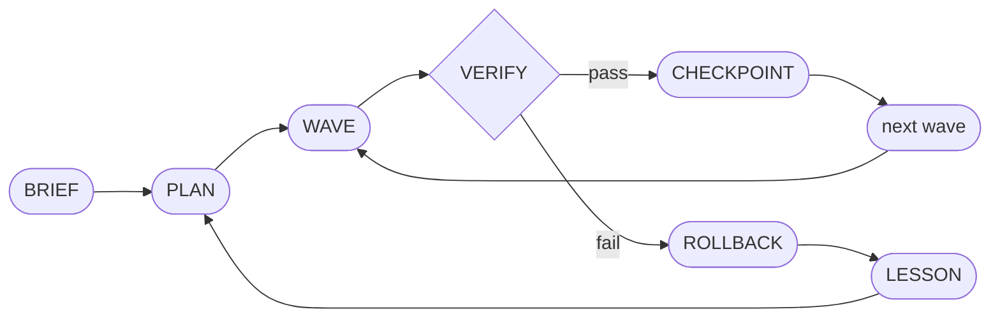
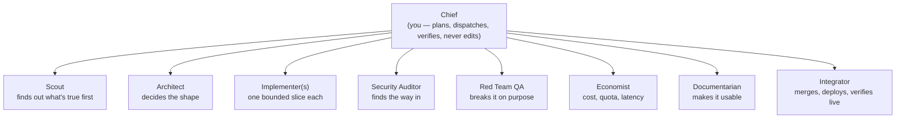
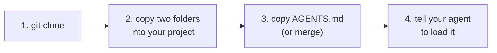

# Directorate

[](LICENSE)
[](https://claude.com/claude-code)
[](https://opencode.ai)
[](https://agents.md)
[](https://www.python.org/)

A multi-agent orchestration skill for coding agents. One **boss agent** ("the Chief")
plans a mission, delegates work orders to specialist directors, who delegate to their own
workers, and the boss verifies every result, checkpoints what passes, rolls back what
fails — and writes each failure into a persistent ledger that gets injected into all
future work. Built for [Claude Code](https://claude.com/claude-code); works natively in
[OpenCode](https://opencode.ai); reaches [Codex](https://openai.com/codex/) and 20+ other
tools through [AGENTS.md](https://agents.md).

The point isn't parallelism. It's that a mistake gets written down once and stops
recurring the same way. Nothing here measures that for you automatically — it's a claim
you can check yourself (`.directorate/ledger/lessons.jsonl` on mission ten vs. mission
one), not a number the tooling computes.

## Contents

- [How it works](#how-it-works)
- [Install](#install)
- [Quick start](#quick-start)
- [What's in the box](#whats-in-the-box)
- [The three ideas](#the-three-ideas)
- [Design notes](#design-notes)
- [Boundaries](#boundaries)
- [Requirements](#requirements)
- [Worked example](#worked-example)
- [License](#license)

## How it works





Two tiers of delegation only — a director may hire a worker for a narrow sub-task
(a Test Writer, a Fuzzer, a Benchmark Runner); a worker never hires. Full roster with
mandates and verification hooks for each post is in
[`references/roster.md`](.claude/skills/directorate/references/roster.md).

## Install



**1. Clone this repo**

```bash
git clone https://github.com/NapolianAdmin/directorate
```

**2. Copy the two skill folders into your project**

```bash
cp -r directorate/.claude/skills/directorate   your-project/.claude/skills/
cp -r directorate/.claude/skills/lesson-forge  your-project/.claude/skills/
```

This one location — `.claude/skills/<name>/SKILL.md` — is read natively by both
**Claude Code** and **OpenCode** (OpenCode's own loader scans `.opencode/skills/`,
`.claude/skills/`, and `.agents/skills/` together, so nothing needs duplicating).

**3. Copy the AGENTS.md pointer** (for Codex and anything else that reads AGENTS.md
instead of loading skills selectively)

```bash
cp directorate/AGENTS.md your-project/AGENTS.md   # or merge its "Directorate" section
                                                    # into an existing AGENTS.md — nested
                                                    # AGENTS.md files are part of the spec
```

**4. Tell your agent to use it**, at your repo root:

```
Load the directorate skill and act as Chief for this mission: <what you want built>
```

Full ready-to-paste prompts — autonomous long-runs, brainstorm waves, codebase audits —
are in [KICKOFF.md](KICKOFF.md).

> [!NOTE]
> Every cross-platform claim above is checked against each platform's own current
> documentation, not against a live session of that platform. See
> [CHANGELOG.md](CHANGELOG.md) for exactly what's confirmed vs. still open.

## Quick start

```bash
python .claude/skills/directorate/scripts/directorate.py init      # scaffold .directorate/
python .claude/skills/directorate/scripts/directorate.py brief     # standing rules + hot lessons
python .claude/skills/directorate/scripts/directorate.py lesson add \
  --tag deploy --severity high \
  --text "Vercel Hobby functions hard-cap at 10s; multi-call aggregation routes must move off serverless."
python .claude/skills/directorate/scripts/directorate.py lesson digest
```

`.directorate/` is meant to be committed. The code can be regenerated; the scar tissue
can't.

## What's in the box

| Path | What it is |
|---|---|
| `.claude/skills/directorate/SKILL.md` | The Chief's operating manual: the loop, the roster, autonomous mode |
| `references/protocol.md` | Work-order and report envelopes, verification patterns, rollback rules |
| `references/roster.md` | Chief plus eight specialist posts, with mandates and delegation rights |
| `references/ledger.md` | The three-tier memory: lessons → standing rules → generated skills |
| `scripts/directorate.py` | Zero-dependency CLI for scaffolding, the ledger, digests and briefs — pure stdlib Python 3.9+ |
| `.claude/skills/lesson-forge/SKILL.md` | Promotes accumulated rules into new, auto-loading skills |
| `AGENTS.md` | Entry point for agents that don't have a selective skill-loading mechanism |
| `.claude-plugin/plugin.json` | Schema-validated manifest so this installs as a Claude Code plugin, not just a copy-paste |
| `examples/worked-mission/` | A real `.directorate/` directory from an actual mission — not a mockup |

## The three ideas

**The boss doesn't do the work.** A Chief that starts patching files loses the plan, the
budget, and the ability to judge the output with fresh eyes. It plans, dispatches,
verifies.

**A report is a claim, not a fact.** Agents are optimistic. Every order names its own
verification command before it's dispatched; every report pastes real output; the Chief
reads the diff against what the report says it did. Weakened tests, `ts-ignore` near the
failure, files touched outside the boundary — these are what the check is for.

**Failures get cheaper.** Every rollback writes a tagged lesson. Lessons that recur become
standing rules injected into every order. Clusters of rules become real skills that load
automatically. A mistake is loud once, then a whisper, then ambient competence.

## Design notes

- **Two tiers of delegation, never three.** Directors hire workers; workers don't hire.
  Nothing enforces this at the tool level — it's enforced by what an order's objective
  asks for. See [Boundaries](#boundaries).
- **Waves must be file-disjoint.** Two agents editing one file is the most common way a
  multi-agent run destroys its own output. Enforce it at plan time, not merge time.
- **Roll back, don't repair — but per order, not per wave.** A wave where some orders
  pass and one fails is the common case, not the edge case; a blind `git reset --hard`
  throws away the passing work too. `references/protocol.md` has the tested, git-native
  fix: verify before committing anything, then revert only the failed order's files.
- **Human gates are non-negotiable.** Deploys, migrations on real data, spending money,
  publishing, deleting. Autonomy stops there — enforced by the Chief choosing to stop,
  not by a tool permission. Treat the mission's risk register as the actual gate.
- **`git add -A` stages everything, not just the order's boundary.** Check for anything
  credential-shaped before a checkpoint commit — a `.env`, a key pasted into a fixture.
- **Fewer, better lessons.** Two hundred lessons means no lessons, because nothing gets
  read. Digest, merge, delete.

## Boundaries

A skill this permissive needs an explicit line. Directorate dispatches subagents but
never tells them to bypass a human gate, hide what they did, or treat fetched web/file
content as instructions rather than data (see the Scout's mandate in
[`references/roster.md`](.claude/skills/directorate/references/roster.md)). If you're
extending this for your own project, keep that line — a skill a stranger trusts should
never surprise them.

## Requirements

Any coding agent that can run shell commands and spawn a subagent for bounded work, plus
Python 3.9+ (standard library only — zero dependencies) and a git repo: checkpoints and
rollbacks are ordinary commits and resets.

## Worked example

[`examples/worked-mission/`](examples/worked-mission/) is a real `.directorate/`
directory from an actual mission this skill ran — real checkpoint SHAs, nine real
work-order reports (including one where an implementer refused an instruction it judged
dishonest, and wrote up why), a real ledger. Not a mockup built to look good.

## License

MIT. See [LICENSE](LICENSE).
